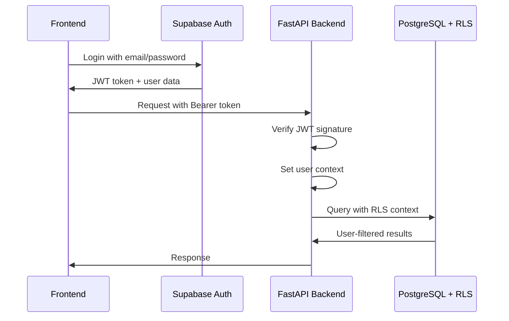

# Authentication Overview

Learn about supastarter's enterprise-grade hybrid authentication system.

## Architecture

Supastarter implements a **hybrid authentication system** that combines:
- **Supabase Auth** as the primary authentication provider
- **Custom JWT handling** for inter-service communication
- **Row Level Security (RLS)** for data isolation
- **Context-based user sessions** with request tracing

## Authentication Flow



## Key Features

### Security-First Design
- **JWT Token Validation** on every API request
- **User Context Isolation** using Python contextvars
- **Request Tracing** with unique request IDs
- **Rate Limiting** per user across all services

### Supabase Integration
- **Native Auth Service** handling login/logout/registration
- **Auth.users Table** as the source of truth
- **RLS Policies** automatically enforced
- **Real-time Subscriptions** with user context

### Multi-Container Support
- **Stateless Authentication** across all API containers
- **Shared JWT Secret** for token verification
- **Service-to-Service Auth** for internal communications

## Implementation Details

### Backend Authentication (`api-main/app/core/auth.py`)

```python
class HybridAuthBackend:
    """Unified authentication supporting Supabase and custom JWT"""
    
    async def verify_jwt_token(self, authorization: str) -> Dict[str, Any]:
        # Extract and verify JWT token with complete isolation
        # Set user context for request
        # Generate request ID for tracing
        
    async def get_user_supabase_client(self, user_context: Dict) -> Client:
        # Get Supabase client with user's RLS context
        # CRITICAL: Set user session for RLS
```

### Frontend Authentication (`frontend/lib/auth.ts`)

```typescript
export class UnifiedAuthService {
  static async login(email: string, password: string) {
    // Supabase authentication
    // Store token in secure cookie for SSR
  }
  
  static async getSession() {
    // Retrieve current session
    // Handle token refresh automatically
  }
}
```

## Authentication Components

### [User and Session Management](User_and_session.md)
Learn how user sessions are managed across containers with context isolation and automatic token refresh.

### [OAuth Integration](oAuth.md)
Configure third-party OAuth providers (Google, GitHub, etc.) with Supabase Auth.

### [Permissions and Access Control](Permissions_and_access_control.md)
Implement role-based access control (RBAC) with RLS policies and API-level permissions.

### [Super Admin & Admin UI](Super_Admin_&_Admin_UI.md)
Administrative interfaces for user management, monitoring, and system configuration.

## Security Features

### Row Level Security (RLS)
All database tables implement RLS policies:
```sql
-- Users can only access their own items
CREATE POLICY "Users access own items" ON public.items
FOR ALL USING (auth.uid() = owner_id);
```

### Context Isolation
```python
# Each request gets isolated user context
current_user_context: contextvars.ContextVar[Optional[Dict[str, Any]]] = 
    contextvars.ContextVar('current_user_context', default=None)
```

### Rate Limiting
- **100 requests per minute** per user by default
- **Sliding window** implementation
- **Configurable limits** based on user roles

## Development vs Production

### Development
- **Local Supabase** instance or hosted project
- **Debug logging** for authentication flow
- **Hot reloading** with session persistence

### Production
- **Hosted Supabase** with production credentials
- **Security headers** and HTTPS enforcement
- **Audit logging** for compliance
- **Multi-region** token validation

## Migration Guide

If migrating from `Supabase Auth` or other systems:

1. **User Data Migration**: Export existing users to Supabase auth.users table
2. **Token Update**: Replace existing JWT handling with Supabase tokens
3. **RLS Setup**: Enable and configure Row Level Security policies
4. **API Updates**: Update all protected routes to use hybrid auth system

See the full implementation in the Authentication section guides.
